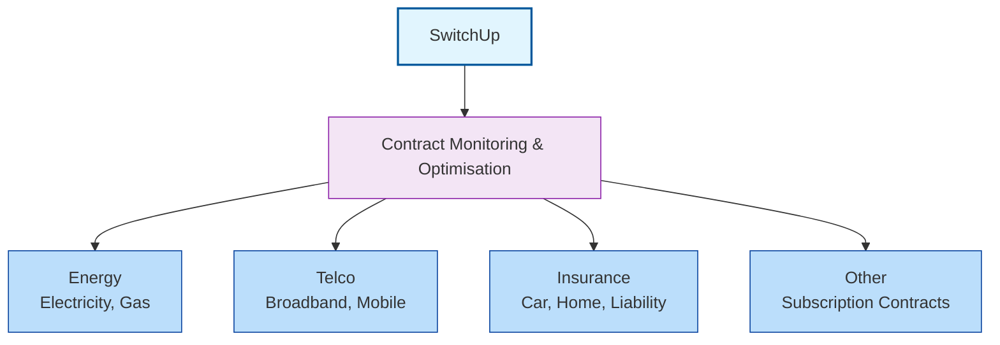
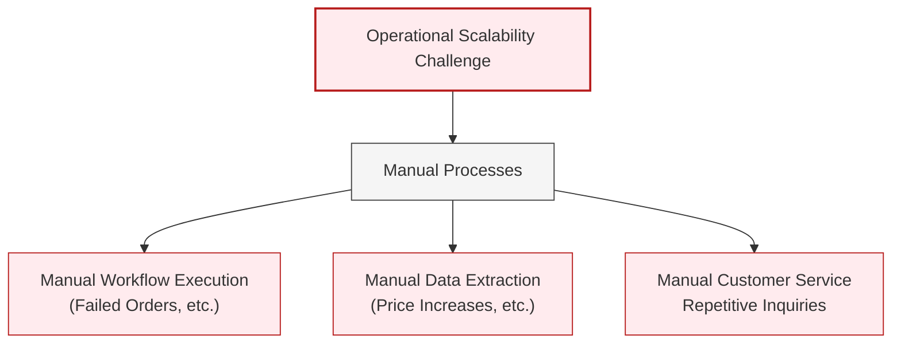

# SwitchUp Business Context

This document outlines the core business of SwitchUp and the main challenge.

## 1. About SwitchUp

[SwitchUp](https://www.switchup.de) acts as a "subscription contract guard", continuously monitoring and optimizing consumer contracts. The service covers a range of recurring, subscription-like contracts, including:

* **Energy:** Electricity, gas, heating electricity.
* **Telco:** Broadband, mobile.
* **Insurance:** Car, home, liability insurance.
* **Other:** Various recurring contract types.

The core value proposition involves identifying contract events (like price increases from provider emails), comparing the current contract with both market offers and retention offers, recommending the best course of action (switch or stay), and automating the optimization process, often by switching the user to a better offer.

## 2. Main Challenge: Operational Scalability

SwitchUp's operations are highly process-driven, revolving around contract events and their corresponding workflows. However, many activities within these workflows still require manual intervention. Key challenges include:

* **Manual Workflow Execution:** Handling the various steps required for specific contract events (e.g., handling a failed order, processing a cancellation, managing price increase notifications and subsequent comparisons including retention options).
* **Manual Data Extraction:** Processing incoming provider communications (emails, documents) to identify events and extract relevant data (e.g., new prices for adjustments, contract dates, *retention offer* details).
* **Manual Customer Service:** Responding to user inquiries, many of which are repetitive, including questions about contract state changes due to adjustments (like price increases).

This reliance on manual effort limits operational scalability, hindering the ability to handle a significantly larger volume of contracts and processes efficiently. The primary goal is to automate the vast majority of these processes.
